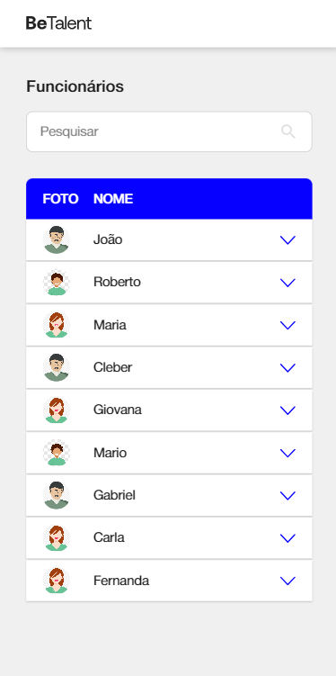
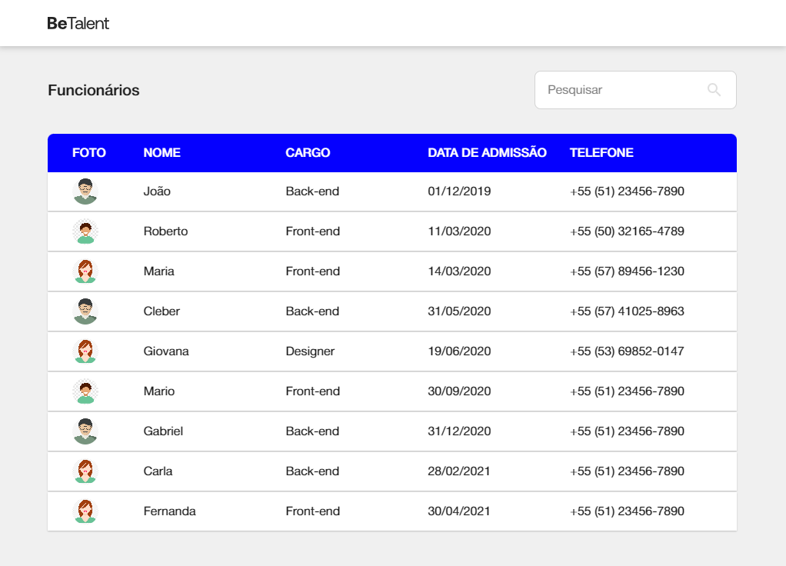

# Desafio Técnico Front-end BeTalent

## Sobre o Projeto

Este projeto faz parte do [Teste Técnico para Front-End da BeTalent](https://github.com/BeMobile/teste-pratico-frontend). O objetivo é desenvolver a visualização de uma tabela contendo dados fornecidos por uma API simulada utilizando `json-server`. O desafio inclui a implementação de funcionalidades como pesquisa na tabela, formatação de datas e números de telefone, e uma interface responsiva.

## Pré-requisitos

Antes de iniciar o projeto, certifique-se de ter instalado em sua máquina:

* **Git** : Para versionamento do código.
* **Node.js** : Ambiente de execução para JavaScript.
* **NPM** : Gerenciador de pacotes para instalar dependências.
* **IDE:** Ambiente de desenvolvimento de código.
* **json-server** : Para simular a API e fornecer os dados ao projeto.

## Como Rodar a Aplicação

1. **Clone o repositório:**

   ```sh
   git https://github.com/LeonardoPaniz/teste-betalent.git
   cd teste-betalent
   ```
2. **Instale as dependências:**

   ```sh
   npm i
   ```
3. **Inicie o json-server para disponibilizar a API simulada:**

   ```sh
   npm run database
   ```
4. **Inicie o projeto em modo de desenvolvimento:**

   ```sh
   npm run dev
   ```
5. **Acesse a aplicação no navegador:**

   ```
   http://localhost:3001
   ```

## Funcionalidades

* Exibição de uma tabela com as seguintes colunas:
  * Imagem (thumb do usuário/a, imagem do db.json);
  * Nome;
  * Cargo;
  * Data de admissão;
  * Telefone.
* Pesquisa por nome, cargo e telefone.
* Formatação de datas e telefones no front-end.
* Interface responsiva.

## Tecnologias Utilizadas

* **Next.js**
* **TypeScript**
* **CSS**
* **json-server**
* **Axios**

## Minhas Redes Sociais!

[](www.linkedin.com/in/LeonardoPanizAguiar)
[](https://github.com/LeonardoPaniz)
[](https://www.instagram.com/leonardo_paniz/)

## Imagens do projeto



